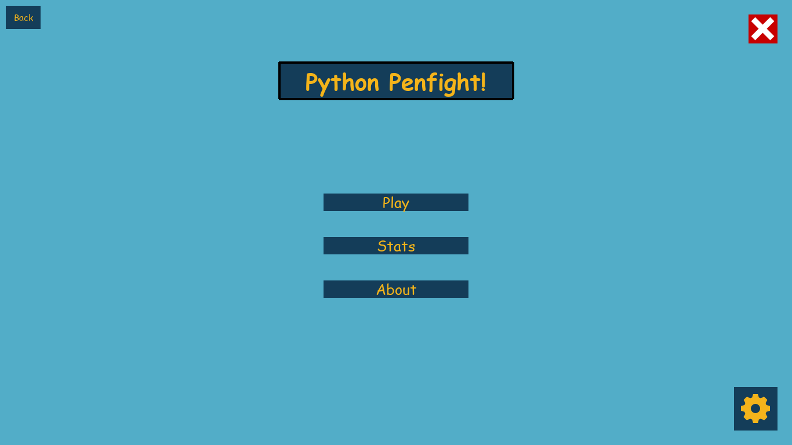
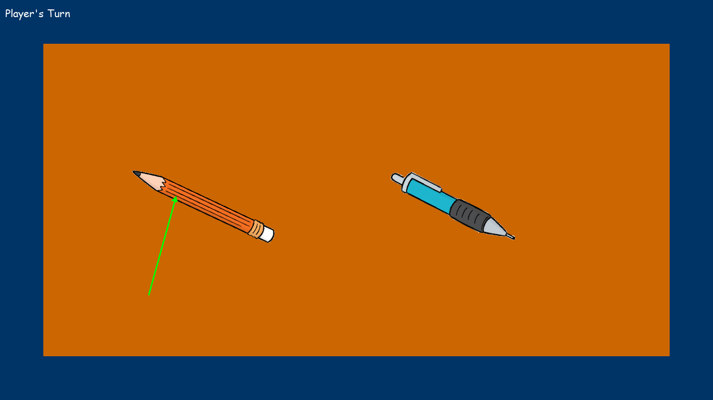
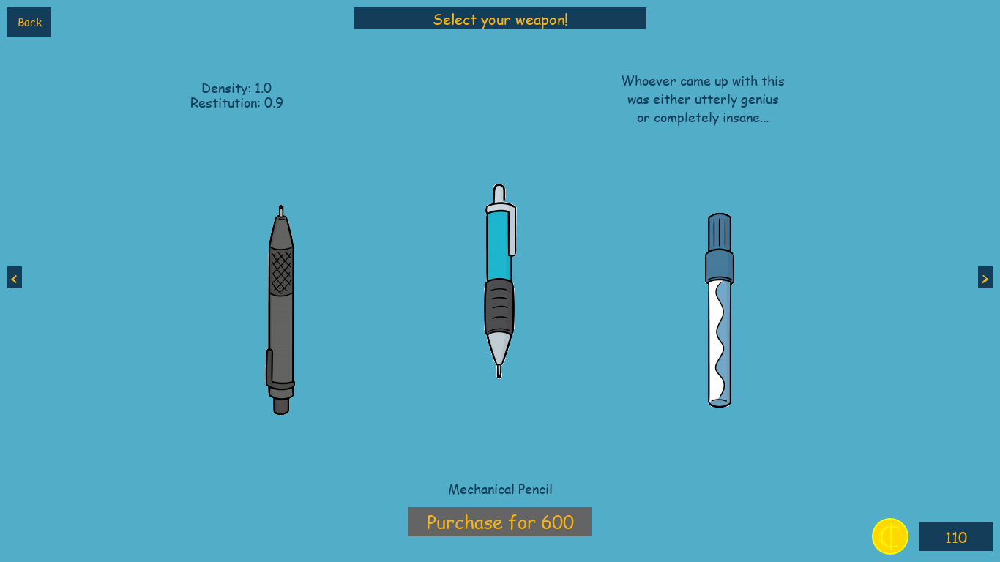
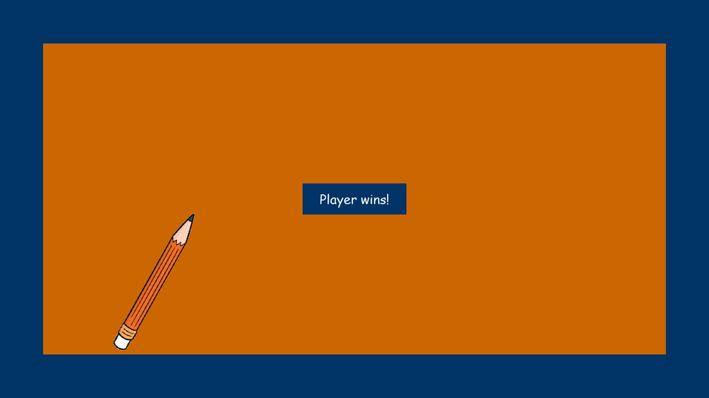

<a name="readme-top"></a>

<!-- PROJECT LOGO -->
<br />
<div align="center">
  <a href="https://github.com/DevChrome/PenFight">
    
  </a>

<h3 align="center">PenFight</h3>

  <p align="center">
Your favorite childhood game remade in python!
  </p>
</div>


<!-- TABLE OF CONTENTS -->
<details>
  <summary>Table of Contents</summary>
  <ol>
    <li>
      <a href="#about-the-project">About The Project</a>
      <ul>
        <li><a href="#built-with">Built With</a></li>
      </ul>
    </li>
    <li>
      <a href="#running-from-source">Running From Source</a>
      <ul>
        <li><a href="#prerequisites">Prerequisites</a></li>
        <li><a href="#instructions">Instructions</a></li>
      </ul>
    </li>
    <li><a href="#screenshots">Screenshots</a></li>
    <li><a href="#license">License</a></li>
  </ol>
</details>


<!-- ABOUT THE PROJECT -->
## About The Project

This is the popular childhood game Pen Fight, made in python, using pygame and Box2D.
<br><br>
Players can buy and collect various pens with differing stats, earn coins by battling various AI strategies, and raise their pen fighting skills to the max. (Best of all, no friends needed for you lonely people looking up pen fighting on Github...)

### Built With

[![Pygame][pygame-img]][pygame-url]
<br>
[![Box2D][box2d-img]][box2d-url]

<!-- GETTING STARTED -->
## Running From Source

To get this project running locally from source, follow these steps:

### Prerequisites

* Python interpreter (>= 3.8)

### Instructions

1. Clone the repo
   ```sh
   git clone https://github.com/DevChrome/Hangman.git
   ```
2. Install the pygame and Box2D modules
   ```sh
   pip install pygame Box2D
   ```
3. Run the main.py file
   ```sh
   python3 ./main.py
   ```

<!-- USAGE EXAMPLES -->
## Screenshots




<!-- LICENSE -->
## License

Distributed under the MIT License. See `LICENSE.txt` for more information.


<p align="right">[<a href="#readme-top">Back To Top</a>]</p>

<!-- MARKDOWN LINKS & IMAGES -->
[pygame-img]: https://www.pygame.org/images/logo_lofi.png
[pygame-url]: https://github.com/pygame/pygame
[box2d-img]: https://box2d.org/images/logo.svg
[box2d-url]: https://box2d.org
